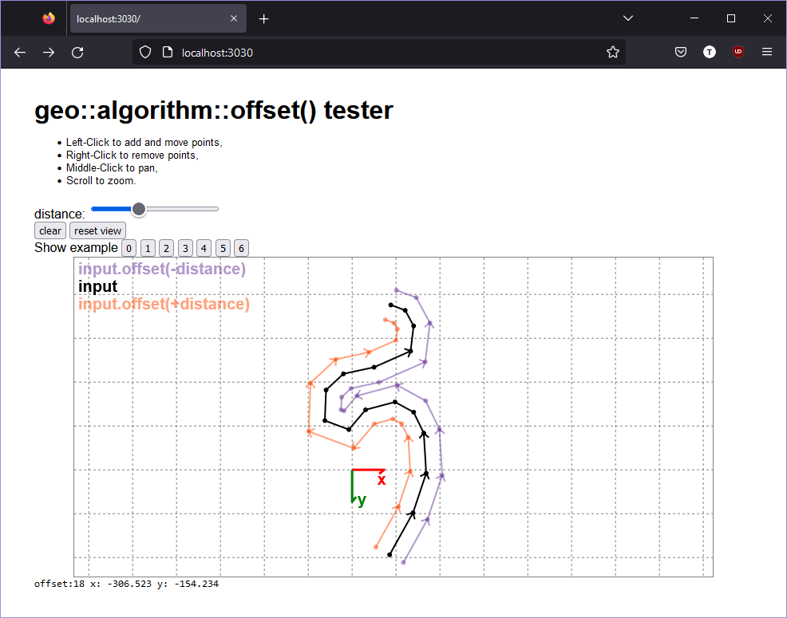

# Geo Offset Tester

I was working on implementing an Offset trait for the rust geo library.

This is an interactive tester server / front-end;
it is a `warp` based server written in Rust which is directly calling my fork of `geo` via a HTML / Javascript UI.

Hopefully it will help me to fix problems like this:

